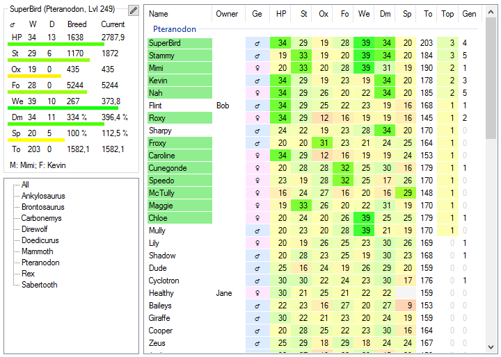
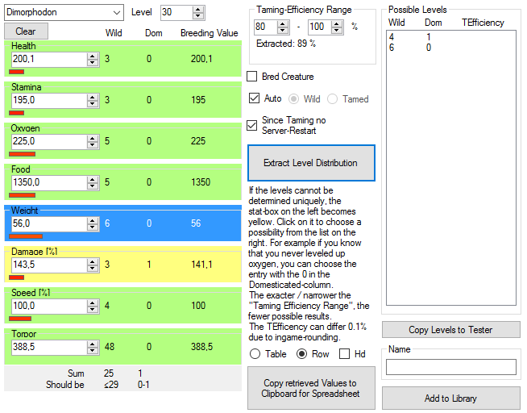
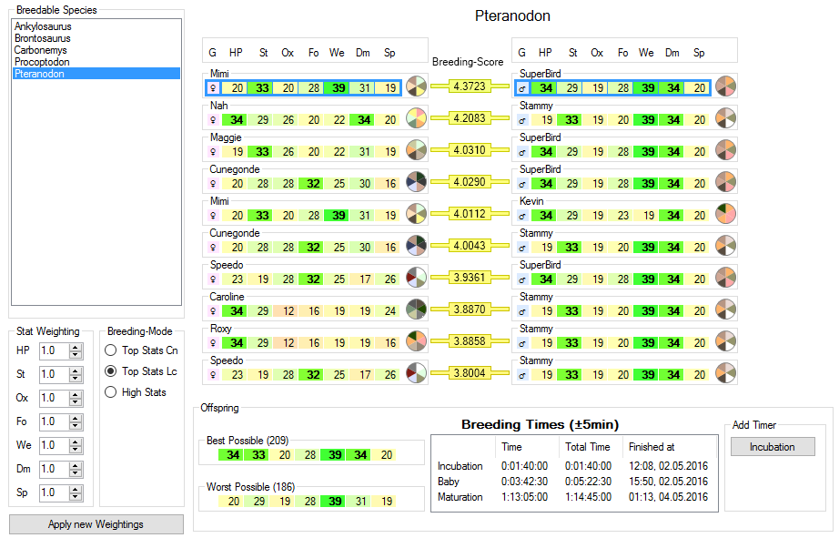
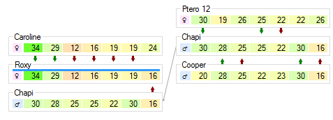
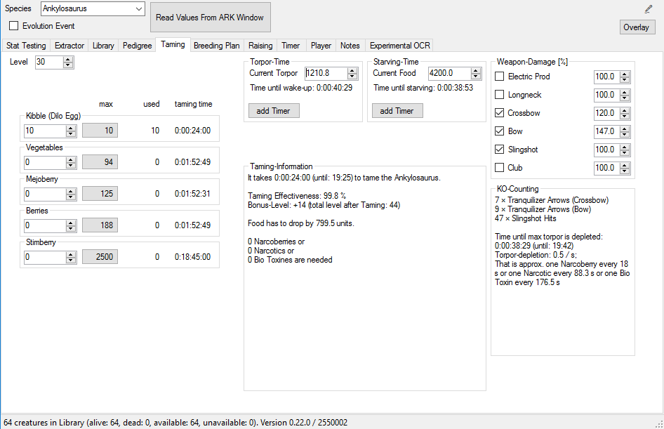
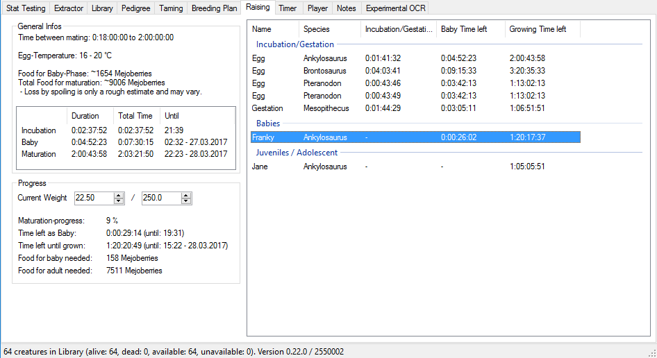

[**Download** the latest release](https://github.com/cadon/ARKStatsExtractor/releases/latest). Support the development of this tool: 

**Discord**: https://discord.gg/qCYYbQK

# ARK Smart Breeding

For the game ARK Survival Evolved. Extracts possible levelups of creatures to get the values for breeding. Save your creatures in a library, sort and compare their stats, view their pedigree, use the breeding-plan to get the best possible creatures and keep track of the growing babies with timers.

## Manual
See the wiki on more info, e.g. [Manual](https://github.com/cadon/ARKStatsExtractor/wiki/Manual) with links to external resources like **guides and videos**, or [Extraction issues](https://github.com/cadon/ARKStatsExtractor/wiki/Extraction-issues) if something does not work.

#### Library

## Screenshots
##### Extractor

##### Breeding Plan

##### Pedigree

##### Taming Infos

##### Raising List

## Download
Download the [latest release here](https://github.com/cadon/ARKStatsExtractor/releases/latest).

* The file values.json contains all the stats, default-multipliers and other values (taming, breeding), it can be edited and updated if necessary.
* The image-files for the colored-creature-views have to be downloaded separately: [Creature-Images](https://github.com/cadon/ARKStatsExtractor/raw/master/images.zip). Extract the folder "img" in the application's folder to get better visuals of the creature's colors. Currently 7 creatures are included. You don't need to redownload this file if you already have the creature-images.

## Patchnotes
* 0.22: Raising-list, improved timers, speech-recognition
* 0.21: Stat-Radar-Chart, Stat-Potential-Chart, Cooldown-column in library
* 0.20: Basic Taming-Calculator, Player-Management, Improved OCR and Overlay
* 0.19: Editing, Extraction improved, Contextmenus, new Breeding-mode, Timer, Fixes.
* 0.18: Breeding-Plan. Colors of creatures. More Settings.
* 0.17.8: GUI-improvements, saves user-settings. Levelbars show percentiles
* 0.17.5: Improved Extraction: First guess more accurate, multipliers are saved to library-file, better parent-sorting, new status-property for creatures
* 0.17: more property-values to compare creatures (Topness), Highlighting only selected stats
* 0.16: added library, pedigree, stat-tester, wild-levelup multiplier
* 0.14: updated stats to 231.9 and added new creatures
* 0.13.1: added support for new creature-balance
* 0.12: fixed algorithm for just tamed creatures ("torpor too high after taming"-bug)
* 0.11.1: updated stats.txt for scorpions tamed before v225
* 0.11: updated creature-stats in stats.txt, changed algorithm to not needing xp anymore and removed level.txt (easier for custom server)
* 0.10: sum of levels and what it should be to easier see correct combinations, fixes
* 0.9.3: fixes, torpor-bug workaround, new row-output-format
* 0.9: fixes, improved algorithm for better results, support for already bred creatures
* 0.8: fix for max-level-determination, ui-improvements
* 0.7: fix for rounding-errors (occured in high-level-creatures)
* 0.6: small fixes and improvements
