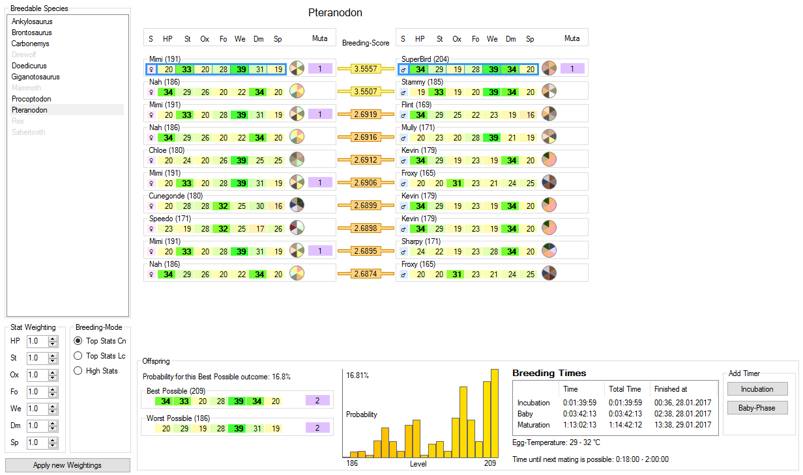
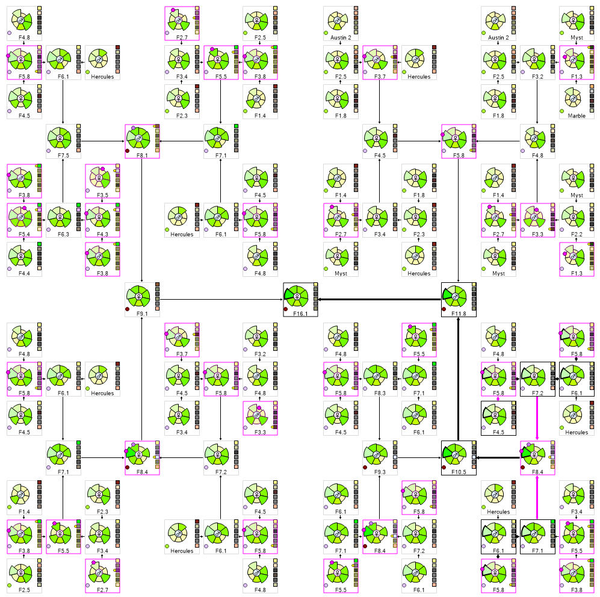

[**Download** the latest release](https://github.com/cadon/ARKStatsExtractor/releases/latest).

**Which version** to take?

* Use the setup-ArkSmartBreeding-(version).**exe** for an installation in the system's programs folder. Suitable for single user installations.
* Extract the ARK.Smart.Breeding_(version).**zip** in an arbitrary folder to use it as a portable or shared installation.

**Discord**: [https://discord.gg/qCYYbQK](https://discord.gg/qCYYbQK)

# ARK Smart Breeding
For the game ARK Survival Evolved. Extracts possible levelups of creatures to get the values for breeding. Save your creatures in a library, 
sort and compare their stats, view their pedigree, use the breeding-plan to get the best possible creatures and keep track of the growing babies with timers.

## Manual
See the wiki on more info, e.g. [Manual](https://github.com/cadon/ARKStatsExtractor/wiki/Manual) with links to external resources like **guides and videos**, 
or [Extraction issues](https://github.com/cadon/ARKStatsExtractor/wiki/Extraction-issues) if something does not work.

## Known issues
### Ark Bugs 
#### Wrong Stat Values
The following species may show wrong stat-values ingame that prevents a correct extraction. Mostly the stat health is affected, sometimes weight, stamina or food. Currently there's no known workaround for this bug in ARK.
* Desert Titan
  * Health (base value 250000 -> 200000)
* Desert Titan Flock
  * Health (base value 4000 -> 7500)
* Electrophorus and its abberant variant
  * Health (base value 180 -> 260)
* Gacha
  * Weight (increase per level 0.04 -> 0.02)
* Ice Titan
  * Health (base value 350000 -> 230000)
* Pegomastax
  * Health (base value 120 -> 200)
* Procoptodon
  * Health (taming addition 0.75 -> 0.5)
  * Stamina (taming addition 0.1 -> 0)
* Pulmonoscorpius and its abberant variant
  * Health (base value 280 -> 300)
* Titanoboa and its abberant variant
  * Health (base value 170 -> 300)
* Troodon
  * Food (base value 200 -> 100)

#### Imprinting Bug
* Creatures sometimes forget to increase their values properly after imprinting
* Force creature to recalculate stats by:
  * Upload/Download from Tek Transmitter, Supply Drop, or Obelisk
  * Use a Cryopod
  * Leave render range for a couple of minutes and return
  
### ASB Issues 
#### Capture Ark Window (OCR)
* Rather inaccurate
* Limited details about creatures
* Limited supported resolutions
* **Use [Creature Import](https://github.com/cadon/ARKStatsExtractor/wiki/Importing-Creatures#ark-exports) instead**

## Screenshots
##### Library

##### Extractor

##### Breeding Plan

##### Pedigree

##### H-pedigree for inheritance tracking

##### Taming Infos

##### Raising List

## Download
Download the [latest release here](https://github.com/cadon/ARKStatsExtractor/releases/latest).

## Patchnotes
For a full list see [Releases](https://github.com/cadon/ARKStatsExtractor/releases).
