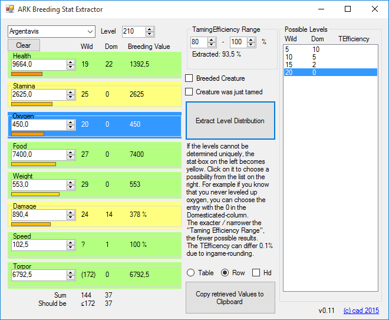

# ARKStatsExtractor

For the game ARK Survival Evolved. Extracts possible levelups of creatures to get the values that are inherited.

* Type in stats of creature
* Click Extract
* View possible wild and domesticated levelups
* Copy Stats in Breeding-Spreadsheet

## Download
Download the [latest release here](releases/latest).

* The file stats.csv contains all the stats, it can be edited and updated if necessary.
* The file level.txt contains all the xp needed for a level. Edit it if your server uses custom values for levelups.

## Patchnotes
* v0.10: sum of levels and what it should be to easier see correct combinations, fixes
* v0.9.3: fixes, torpor-bug workaround, new row-output-format
* v0.9: fixes, improved algorithm for better results, support for already bred creatures
* v0.8: fix for max-level-determination, ui-improvements
* v0.7: fix for rounding-errors (occured in high-level-creatures)
* v0.6: small fixes and improvements