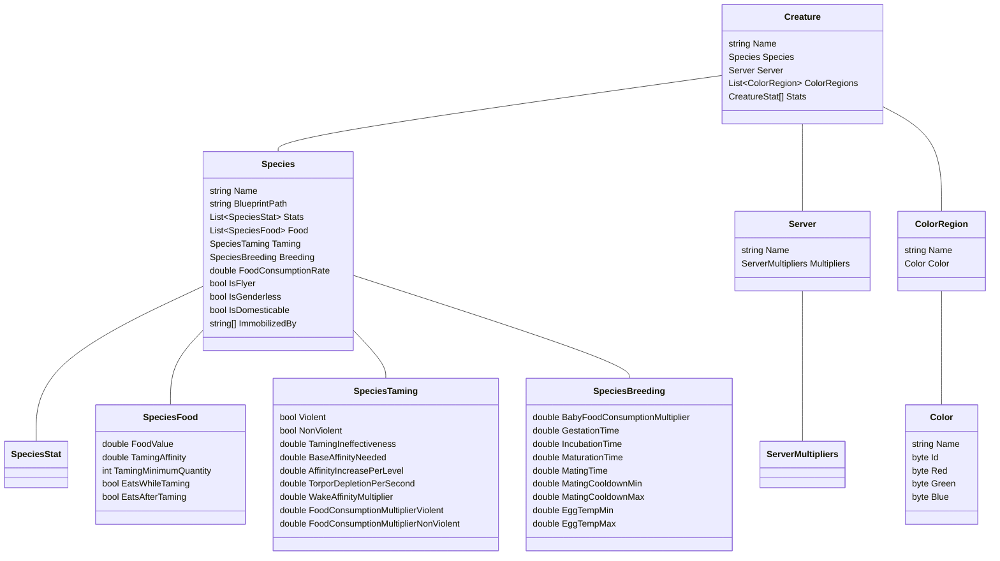

```mermaid
classDiagram
  class Creature {
    string Name
    Species Species
    Server Server
    List~ColorRegion~ ColorRegions
    CreatureStat[] Stats
  }

  class Species {
    string Name
    string BlueprintPath

    List~SpeciesStat~ Stats

    List~SpeciesFood~ Food

    SpeciesTaming Taming
    SpeciesBreeding Breeding
    double FoodConsumptionRate

    bool IsFlyer
    bool IsGenderless
    bool IsDomesticable

    string[] ImmobilizedBy
  }

  class ColorRegion {
    string Name
    Color Color
  }

  class Color {
    string Name
    byte Id

    byte Red
    byte Green
    byte Blue
  }

  class SpeciesFood {
    double FoodValue
    double TamingAffinity
    int TamingMinimumQuantity
    bool EatsWhileTaming
    bool EatsAfterTaming
  }

  class SpeciesStat {
  }

  class SpeciesTaming {
    bool Violent
    bool NonViolent
    double TamingIneffectiveness
    double BaseAffinityNeeded
    double AffinityIncreasePerLevel
    double TorporDepletionPerSecond
    double WakeAffinityMultiplier
    double FoodConsumptionMultiplierViolent
    double FoodConsumptionMultiplierNonViolent
  }

  class SpeciesBreeding {
    double BabyFoodConsumptionMultiplier
    double GestationTime
    double IncubationTime
    double MaturationTime
    double MatingTime
    double MatingCooldownMin
    double MatingCooldownMax
    double EggTempMin
    double EggTempMax
  }

  class Server {
    string Name
    ServerMultipliers Multipliers
  }

  class ServerMultipliers {
  }

  Creature -- Species
  Creature -- Server
  Creature -- ColorRegion
  ColorRegion -- Color
  Species -- SpeciesStat
  Species -- SpeciesFood
  Species -- SpeciesTaming
  Species -- SpeciesBreeding
  Server -- ServerMultipliers
```