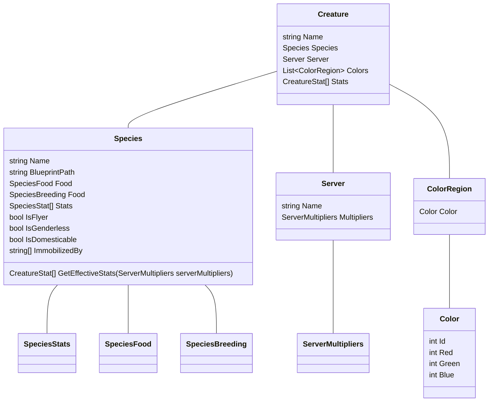

```mermaid
classDiagram
  class Creature {
    string Name
    Species Species
    Server Server
    List~ColorRegion~ Colors
    CreatureStat[] Stats
  }

  class Species {
    string Name
    string BlueprintPath

    SpeciesFood Food
    SpeciesBreeding Food
    
    SpeciesStat[] Stats

    bool IsFlyer
    bool IsGenderless
    bool IsDomesticable
    
    string[] ImmobilizedBy

    CreatureStat[] GetEffectiveStats(ServerMultipliers serverMultipliers)
  }

  class ColorRegion {
    Color Color
  }

  class Color {
    int Id
    int Red
    int Green
    int Blue
  }

  class SpeciesFood {
  }

  class SpeciesStats {
  }

  class SpeciesBreeding {
  }

  class Server {
    string Name
    ServerMultipliers Multipliers
  }

  class ServerMultipliers {
  }

  Creature -- Species
  Creature -- Server
  Creature -- ColorRegion
  ColorRegion -- Color
  Species -- SpeciesStats
  Species -- SpeciesFood
  Species -- SpeciesBreeding
  Server -- ServerMultipliers
```